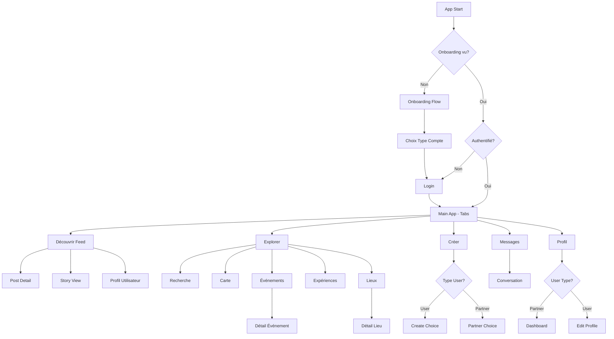

# 📐 Architecture du Projet Yeyamo Mobile

## 🎯 Vue d'ensemble

Yeyamo Mobile est une application mobile React Native construite avec **Expo v56** et **Expo Router** pour la navigation. L'application propose une plateforme sociale pour découvrir des lieux, des événements, et des expériences, avec des fonctionnalités de feed, messagerie, création de contenu et profils utilisateurs.

## 🏗️ Stack Technique

### Core Technologies
- **React Native** v0.85.3 avec React v19.2.3
- **Expo SDK** v56 (Expo Router, Expo Image, Expo Camera, Expo Location, etc.)
- **TypeScript** v6.0.3 avec configuration stricte
- **NativeWind** v4.2.5 (Tailwind CSS pour React Native)

### État et Données
- **Zustand** v5.0.14 - Gestion d'état global
- **React Query (TanStack)** v5.101.0 - Gestion du cache et requêtes API
- **Axios** v1.18.0 - Client HTTP
- **Expo Secure Store** - Stockage sécurisé des tokens

### Navigation et UI
- **Expo Router** v56.2.11 - Navigation file-based
- **React Native Gesture Handler** v2.31.1
- **React Native Reanimated** v4.3.1
- **Bottom Sheet** (@gorhom) v5.2.14

### Validation et Formulaires
- **React Hook Form** v7.80.0
- **Zod** v4.4.3


## 📁 Structure des Dossiers

```
yeyamo-mobile/
├── src/
│   ├── app/                          # Routes Expo Router (file-based routing)
│   │   ├── (auth)/                   # Groupe de routes d'authentification
│   │   ├── (onboarding)/             # Flux d'onboarding initial
│   │   ├── (tabs)/                   # Navigation par onglets principale
│   │   ├── (explore)/                # Pages d'exploration détaillées
│   │   ├── (create)/                 # Flux de création de contenu (utilisateur)
│   │   ├── (partner)/                # Flux de création de contenu (partenaire)
│   │   ├── (partner-dashboard)/      # Tableau de bord partenaire
│   │   ├── (chat)/                   # Conversation individuelle
│   │   ├── (post)/                   # Détails d'un post
│   │   ├── (story)/                  # Visualisation des stories
│   │   ├── (places)/                 # Détails d'un lieu
│   │   ├── (events)/                 # Détails d'un événement
│   │   ├── (experiences)/            # Détails d'une expérience
│   │   ├── (profile)/                # Profils utilisateurs publics
│   │   ├── (regions)/                # Exploration par région
│   │   ├── _layout.tsx               # Layout racine avec route guards
│   │   └── +not-found.tsx            # Page 404
│   │
│   ├── components/                   # Composants UI organisés par feature
│   │   ├── ui/                       # Composants UI réutilisables (Button, Avatar, Icon...)
│   │   ├── auth/                     # Composants d'authentification
│   │   ├── feed/                     # Composants du feed
│   │   ├── chat/                     # Composants de messagerie
│   │   ├── explore/                  # Composants d'exploration
│   │   ├── create/                   # Composants de création
│   │   ├── story/                    # Composants de stories
│   │   ├── profile/                  # Composants de profil
│   │   ├── events/                   # Composants d'événements
│   │   ├── places/                   # Composants de lieux
│   │   ├── experiences/              # Composants d'expériences
│   │   ├── comments/                 # Composants de commentaires
│   │   ├── onboarding/               # Composants d'onboarding
│   │   └── partner-dashboard/        # Composants du dashboard partenaire
│   │
│   ├── features/                     # Logique métier par feature (domain-driven)
│   │   ├── auth/                     # Authentification
│   │   │   ├── auth.api.ts           # Endpoints API
│   │   │   ├── auth.service.ts       # Logique métier
│   │   │   ├── auth.store.ts         # État Zustand
│   │   │   ├── useAuth.ts            # Hook personnalisé
│   │   │   └── types.ts              # Types TypeScript
│   │   ├── feed/                     # Feed de contenu
│   │   ├── chat/                     # Messagerie temps réel
│   │   ├── create/                   # Création de contenu
│   │   ├── explore/                  # Exploration et découverte
│   │   ├── post/                     # Gestion des posts
│   │   ├── story/                    # Stories éphémères
│   │   ├── profile/                  # Profils utilisateurs
│   │   ├── events/                   # Événements
│   │   ├── places/                   # Lieux
│   │   ├── experiences/              # Expériences
│   │   ├── comments/                 # Commentaires
│   │   ├── onboarding/               # Onboarding
│   │   ├── partner/                  # Gestion partenaire
│   │   └── partner-dashboard/        # Dashboard partenaire
│   │
│   ├── services/                     # Services transverses
│   │   ├── api/                      # Configuration HTTP
│   │   │   └── client.ts             # Instance Axios configurée
│   │   ├── storage/                  # Stockage local
│   │   │   └── secure-store.ts       # Wrapper Expo Secure Store
│   │   └── socket/                   # WebSocket temps réel
│   │       └── reverb.client.ts      # Client Laravel Reverb
│   │
│   ├── config/                       # Configuration globale
│   │   └── env.ts                    # Variables d'environnement
│   │
│   ├── constants/                    # Constantes globales
│   │   └── theme.ts                  # Thème et couleurs
│   │
│   ├── types/                        # Types partagés
│   │   └── api.types.ts              # Types API communs
│   │
│   ├── hooks/                        # Hooks React personnalisés globaux
│   └── utils/                        # Utilitaires génériques
│
├── assets/                           # Ressources statiques (images, icônes)
├── app.json                          # Configuration Expo
├── package.json                      # Dépendances et scripts
├── tsconfig.json                     # Configuration TypeScript
├── tailwind.config.js                # Configuration Tailwind/NativeWind
└── babel.config.js                   # Configuration Babel
```


## 🎨 Architecture de Navigation (Expo Router)

### Root Layout (`_layout.tsx`)

Le layout racine gère :
1. **Hydratation de session** : Restauration du token depuis Secure Store au démarrage
2. **Route guards** : Redirection automatique selon l'état d'authentification et d'onboarding
3. **Configuration des stacks** : Définition de toutes les routes et leurs animations

**Logique de routing** :
```
Non authentifié + Onboarding non vu → /(onboarding)/splash
Non authentifié + Onboarding vu → /(auth)/login
Authentifié → /(tabs)/
```

**Gestion des erreurs 401** :
- Intercepteur Axios détecte les 401
- Efface le Secure Store
- Appelle `registerUnauthenticatedHandler` pour rediriger vers login

### Types de Présentation

| Route | Présentation | Animation |
|-------|-------------|-----------|
| `(tabs)/*` | Bottom tabs | default |
| `(post)/[id]` | Modal | slide_from_bottom |
| `(create)/choice` | Modal | slide_from_bottom |
| `(story)/[id]` | Full screen modal | fade |
| `(chat)/[id]` | Stack | slide_from_right |
| Autres détails | Stack | default |


## 🗂️ Les 5 Menus Principaux (Bottom Tabs)

### 1. 🏠 **Découvrir** (Feed) - `/(tabs)/index.tsx`

**Objectif** : Feed de contenu vertical (vidéos, images, carrousels)

**Composants clés** :
- `StoriesList` : Bande de stories en haut
- `VerticalFeedList` : Liste infinie de posts (videos/images)
- `VideoCard` / `VerticalFeedItem` : Cartes de contenu

**Features** :
- ✅ Infinite scroll avec React Query
- ✅ Stories en haut du feed
- ✅ Filtre par localisation (header)
- ✅ Like, commentaire, partage sur chaque post
- ✅ Tag de lieu cliquable

**État géré** :
- `useFeed()` hook : Pagination infinie avec `useInfiniteQuery`
- Cache React Query avec staleTime 2 min

**Navigation sortante** :
- Clic sur story → `/(story)/[id]`
- Clic sur post → `/(post)/[id]`
- Clic sur lieu tagué → `/(places)/[id]`
- Clic sur auteur → `/(profile)/[username]`
- Recherche → `/(explore)/search`

---

### 2. 🔍 **Explorer** (Explore) - `/(tabs)/explore.tsx`

**Objectif** : Hub de découverte de lieux, événements et expériences

**Structure de la page** :
```
├── Header : Localisation + notifications
├── Titre d'accueil personnalisé
├── Barre de recherche → /(explore)/search
├── Accès rapide
│   ├── Événements → /(explore)/events
│   └── Expériences → /(explore)/experiences
├── Catégories (grid 3 colonnes)
│   └── CategoryCard × N
└── Tendances près de vous (horizontal scroll)
    └── TrendingPlaceCard × N
```

**Composants clés** :
- `CategoryCard` : Icône + nom de catégorie
- `TrendingPlaceCard` : Image + nom + localisation + note
- `FilterButton` : Filtres de recherche

**Features** :
- ✅ Recherche globale
- ✅ Navigation vers listes filtrées
- ✅ Catégories de lieux (restaurants, bars, parcs...)
- ✅ Carte interactive
- ✅ Filtres avancés

**Navigation sortante** :
- Recherche → `/(explore)/search`
- Événements → `/(explore)/events`
- Expériences → `/(explore)/experiences`
- Carte → `/(explore)/map`
- Lieux → `/(explore)/places`
- Catégorie → `/(explore)/places?category=X`
- Lieu → `/(places)/[id]`

**Sous-pages d'exploration** :

#### `/explore/search` - Recherche unifiée
- Recherche de lieux, événements, expériences
- Filtres : catégorie, distance, note, prix
- Résultats mixtes

#### `/explore/events` - Liste d'événements
- EventCard en liste
- Filtres : date, catégorie, prix
- Clic → `/(events)/[id]`

#### `/explore/experiences` - Liste d'expériences
- ExperienceCard en liste
- Filtres similaires aux événements
- Clic → `/(experiences)/[id]`

#### `/explore/places` - Liste de lieux
- PlaceListItem en liste
- Filtres : catégorie, note, distance, prix
- Clic → `/(places)/[id]`

#### `/explore/map` - Vue carte
- React Native Maps
- Marqueurs cliquables
- Bottom sheet de détails

---

### 3. ➕ **Créer** (Create) - `/(tabs)/create.tsx`

**Objectif** : Point d'entrée pour créer du contenu

**Comportement** :
Le composant `create.tsx` est un **simple redirecteur** :
```typescript
useEffect(() => {
  // Détecte le rôle utilisateur
  if (user?.user_type === 'partner') {
    router.push('/(partner)/choice');
  } else {
    router.push('/(create)/choice');
  }
}, []);
```

**Flux Utilisateur** : `/(create)/*`

#### `/create/choice` (Modal)
- Choix du type de contenu :
  - 📸 Publication (image/vidéo)
  - 📹 Story (24h)
  - 🎉 Événement
  - 📍 Suggérer un lieu

#### `/create/publication`
- Sélection média (galerie ou caméra)
- Caption
- Tag de lieu
- Tag d'utilisateurs
- → Publication via `post.api.ts`

#### `/create/story`
- Capture vidéo/photo en full screen
- Stickers, texte, dessin
- Durée 5s (configurable)
- Visibilité : tous / followers / close friends
- → Publication via `story.api.ts`

#### `/create/event` + `/create/event-settings`
- **Step 1** : Informations de base
  - Titre, description, image de couverture
  - Lieu (recherche ou création)
  - Date et heure
  - Nombre max de participants
- **Step 2** : Paramètres avancés
  - Visibilité (public/privé)
  - Autoriser les inconnus
  - Commentaires (tous/participants)
  - Liste d'attente
  - Invitation d'utilisateurs
- → Création via `events/events.api.ts`

#### `/create/suggest-place-step1` + `step2`
- **Step 1** : Informations du lieu
  - Nom, catégorie, adresse
  - Photo
  - Description
- **Step 2** : Détails
  - Horaires
  - Équipements
  - Fourchette de prix
- → Suggestion via `places/places.api.ts`

**État géré** :
- `useCreateStore()` : Store Zustand pour les formulaires multi-étapes
  - `eventForm`, `placeForm`, `storyData`, `publicationData`
  - Persistance durant la navigation dans le flux

---

**Flux Partenaire** : `/(partner)/*`

Structure similaire mais adaptée aux partenaires :
- `/partner/choice` : Publication, Story, Ajouter lieu, Ajouter événement
- `/partner/add-place-step1` à `step4` : Création complète de lieu
- `/partner/add-event-step1` à `step4` : Création complète d'événement
- Validations renforcées
- Plus d'options de personnalisation


---

### 4. 💬 **Messages** (Chats) - `/(tabs)/chats.tsx`

**Objectif** : Messagerie temps réel avec conversations individuelles et groupes

**Structure de la page** :
```
├── Header : Titre + bouton recherche
├── Onglets (ChatTabs)
│   ├── Récents (tous)
│   ├── Principaux (users + partners, sans groupes)
│   ├── Non lus
│   └── Groupes
├── Conversations épinglées (PinnedChats)
│   └── Scroll horizontal de conversations favorites
└── Liste de conversations (FlatList)
    └── ChatListItem × N
```

**Composants clés** :
- `ChatTabs` : Onglets avec compteurs de badges
- `PinnedChats` : Conversations épinglées en scroll horizontal
- `ChatListItem` : Avatar + nom + dernier message + timestamp + badge non lu
- Badge avec nombre de messages non lus

**Features** :
- ✅ Filtrage par onglet (recent/main/unread/groups)
- ✅ Conversations épinglées en haut
- ✅ Badge de messages non lus
- ✅ Indicateur de présence en ligne
- ✅ Aperçu du dernier message
- ✅ Support des types de messages (texte, image, event, system)

**Types de conversations** :
```typescript
type ConversationType = 'user' | 'partner' | 'group';
```

**État géré** :
- `useConversations()` hook : Liste des conversations avec React Query
- `useChatStore()` : Buffer temps réel des messages par conversation
- Filtrage côté client selon l'onglet actif

**Navigation sortante** :
- Clic sur conversation → `/(chat)/[id]`
- Recherche → Interface de recherche de conversations

---

#### Page de Conversation : `/(chat)/[id].tsx`

**Structure** :
```
├── Header personnalisé
│   ├── Retour
│   ├── Avatar + nom + statut
│   └── Actions (appel, info)
├── Liste de messages (FlatList inverted)
│   ├── MessageBubble (texte)
│   ├── MessageAttachment (image/vidéo)
│   ├── EventMessageCard (événement partagé)
│   └── SystemMessage (notifications système)
└── Barre d'input (MessageInput)
    ├── TextInput
    ├── Bouton pièce jointe
    ├── Bouton emoji
    └── Bouton envoi
```

**Composants clés** :
- `MessageBubble` : Bulle de message avec style différent selon l'auteur
- `MessageAttachment` : Affichage d'images/vidéos
- `EventMessageCard` : Carte d'événement partagé
- `SystemMessage` : Messages système (rejoint le groupe, etc.)

**Features temps réel** :
- ✅ WebSocket via Laravel Reverb
- ✅ Connexion automatique à l'authentification
- ✅ Écoute du canal `private-conversation.{id}`
- ✅ Réception instantanée des nouveaux messages
- ✅ Indicateur de saisie (typing indicator)
- ✅ Accusés de lecture

**Gestion de l'état** :
```typescript
// Dans chat.store.ts
messages: Record<conversationId, ChatMessage[]>
appendMessage() // Ajoute un message en temps réel
prependMessages() // Charge l'historique en pagination
```

**Architecture WebSocket** :
```typescript
// services/socket/reverb.client.ts
reverbClient.connect(token)
reverbClient.subscribe(`private-conversation.${id}`)
reverbClient.on('NewMessage', (data) => {
  useChatStore.getState().appendMessage(conversationId, data)
})
```

**Navigation sortante** :
- Bouton info → `/(chat)/info/[id]` : Détails de la conversation, médias partagés, participants
- Événement partagé → `/(events)/[id]`
- Lieu partagé → `/(places)/[id]`
- Profil du contact → `/(profile)/[username]`

---

### 5. 👤 **Profil** (Profile) - `/(tabs)/profile.tsx`

**Objectif** : Profil de l'utilisateur connecté + accès aux paramètres

**Structure de la page** :
```
├── Header
│   └── Avatar + nom d'utilisateur + badges
├── Statistiques (Stats Row)
│   ├── Posts
│   ├── Followers
│   └── Following
├── Actions
│   ├── [Partenaire uniquement] Bouton Tableau de bord
│   ├── Modifier le profil
│   └── Se déconnecter
└── Onglets de contenu
    ├── Publications (MediaGrid)
    ├── Événements créés
    ├── Lieux favoris
    └── Enregistrés
```

**Composants clés** :
- `ProfileHeader` : Avatar + infos + boutons d'action
- `StatsRow` : Statistiques en ligne
- `MediaGrid` : Grille de médias 3 colonnes
- `Button` : Boutons d'action

**Features** :
- ✅ Badge de vérification (si `is_verified`)
- ✅ Localisation affichée (ville)
- ✅ Statistiques de l'utilisateur
- ✅ Bouton dashboard partenaire (conditionnel)
- ✅ Déconnexion avec nettoyage complet

**Accès Dashboard Partenaire** :
```typescript
{user.user_type === 'partner' && (
  <TouchableOpacity onPress={() => router.push('/(partner-dashboard)/dashboard')}>
    Tableau de bord
  </TouchableOpacity>
)}
```

**Logout Flow** :
```typescript
const { logout } = useAuth();
// → authService.logout()
// → Appelle API /logout
// → Disconnect Reverb
// → Clear Secure Store
// → clearAuth() dans le store
// → Redirection automatique vers /(auth)/login
```

**Navigation sortante** :
- Tableau de bord → `/(partner-dashboard)/dashboard` (si partenaire)
- Modifier profil → `/profile/edit` (TODO)
- Followers → `/profile/followers` (TODO)
- Following → `/profile/following` (TODO)
- Post de la grille → `/(post)/[id]`

---

#### Profils Publics : `/(profile)/[username].tsx`

**Différences avec le profil personnel** :
- Pas de bouton "Modifier le profil"
- Bouton "Suivre / Ne plus suivre"
- Bouton "Envoyer un message"
- Peut être bloqué/privé

**Features** :
- ✅ Même structure que profil personnel
- ✅ Actions contextuelles (suivre, message, bloquer)
- ✅ Grille de publications publiques uniquement


## 🏢 Tableau de Bord Partenaire

### Architecture du Dashboard : `/(partner-dashboard)/*`

Le tableau de bord partenaire est une section complète dédiée aux utilisateurs avec `user_type === 'partner'`.

**Pages du dashboard** :

#### 1. `/partner-dashboard/dashboard` - Vue d'ensemble

**Composants** :
- `StatCard` : Cartes de statistiques (vues, réservations, revenus)
- Graphiques de tendances
- Activité récente
- Actions rapides

**Métriques affichées** :
- Vues totales du profil
- Nombre de réservations
- Taux de conversion
- Revenus du mois
- Avis moyens

---

#### 2. `/partner-dashboard/establishments` - Gestion des établissements

**Composants** :
- `EstablishmentCard` : Carte d'établissement avec statut, stats
- Bouton "Ajouter un établissement"

**Features** :
- ✅ Liste des lieux du partenaire
- ✅ Statut (actif/en attente/désactivé)
- ✅ Statistiques par lieu (vues, favoris)
- ✅ Actions : modifier, désactiver, supprimer

**Navigation sortante** :
- Modifier → `/(partner)/add-place-step1?edit=true&id=X`
- Ajouter → `/(partner)/add-place-step1`
- Voir détails → `/(places)/[id]`

---

#### 3. `/partner-dashboard/events` - Gestion des événements

**Composants** :
- `EventCard` : Carte d'événement avec date, participants
- Filtres : à venir / passés / brouillons

**Features** :
- ✅ Liste des événements créés
- ✅ Nombre de participants / places restantes
- ✅ Statut de publication
- ✅ Actions : modifier, annuler, dupliquer

**Navigation sortante** :
- Modifier → `/(partner)/add-event-step1?edit=true&id=X`
- Créer → `/(partner)/add-event-step1`
- Détails → `/(events)/[id]`

---

#### 4. `/partner-dashboard/reservations` - Réservations

**Composants** :
- `ReservationCard` : Carte de réservation avec infos client
- Filtres : en attente / confirmées / annulées / passées

**Features** :
- ✅ Liste des réservations reçues
- ✅ Informations du client
- ✅ Détails de la réservation (date, heure, nombre de personnes)
- ✅ Actions : accepter, refuser, annuler

**États d'une réservation** :
```typescript
type ReservationStatus = 
  | 'pending'      // En attente de validation
  | 'confirmed'    // Confirmée
  | 'cancelled'    // Annulée
  | 'completed'    // Terminée
  | 'no-show';     // Client absent
```

---

#### 5. `/partner-dashboard/reviews` - Avis et notes

**Composants** :
- `ReviewCard` : Avis avec note, auteur, commentaire
- Note moyenne globale
- Distribution des notes (graphique)

**Features** :
- ✅ Liste des avis reçus
- ✅ Répondre aux avis
- ✅ Signaler un avis inapproprié
- ✅ Statistiques des notes

**Structure d'un avis** :
```typescript
interface Review {
  id: number;
  rating: number; // 1-5
  comment: string;
  author: UserSummary;
  place?: PlaceSummary;
  created_at: string;
  partner_response?: string;
  partner_response_at?: string;
}
```

---

#### 6. `/partner-dashboard/statistics` - Statistiques détaillées

**Sections** :
- Graphiques de vues (jour/semaine/mois)
- Taux de conversion
- Origine du trafic
- Événements les plus populaires
- Lieux les plus visités
- Données démographiques

**Features** :
- ✅ Filtres par période
- ✅ Export des données
- ✅ Comparaison avec période précédente

---

#### 7. `/partner-dashboard/notifications` - Notifications partenaire

**Types de notifications** :
- Nouvelle réservation
- Nouvel avis
- Établissement validé/rejeté
- Événement bientôt complet
- Rappels (événement demain, etc.)

**Features** :
- ✅ Liste des notifications
- ✅ Filtres : toutes / non lues
- ✅ Marquer comme lu
- ✅ Actions contextuelles selon le type

---

#### 8. `/partner-dashboard/settings` - Paramètres partenaire

**Composants** :
- `SettingsItem` : Élément de paramètre avec navigation

**Sections** :
- Informations du compte partenaire
- Paramètres de réservation
  - Délai de confirmation
  - Politique d'annulation
  - Jours de fermeture
- Notifications
  - Push
  - Email
  - SMS
- Paiements et facturation
- Documents légaux (SIRET, assurance, etc.)
- Support


## 📄 Pages de Détails

### Page Lieu : `/(places)/[id].tsx`

**Structure** :
```
├── Header avec image de couverture
├── PlacePhotoGrid : Galerie de photos
├── Informations principales
│   ├── Nom + badge vérifié
│   ├── Catégorie + note moyenne
│   ├── Adresse + distance
│   └── Prix estimé
├── PlaceActions : Boutons d'action
│   ├── Réserver
│   ├── Favoris
│   ├── Partager
│   └── Directions (Maps)
├── Description
├── PlaceAmenities : Équipements/services
├── Horaires d'ouverture
├── Avis et notes
│   └── Liste de ReviewCard
└── Événements à venir dans ce lieu
    └── Liste de EventCard
```

**Features** :
- ✅ Galerie photo avec zoom
- ✅ Réservation (si activée)
- ✅ Ajout aux favoris
- ✅ Partage du lieu
- ✅ Navigation GPS
- ✅ Affichage des équipements (WiFi, parking, accessible PMR, etc.)
- ✅ Avis utilisateurs avec pagination
- ✅ Événements associés

---

### Page Événement : `/(events)/[id].tsx`

**Structure** :
```
├── Header avec image
├── Informations événement
│   ├── Titre
│   ├── Date et heure
│   ├── Lieu (lien cliquable)
│   ├── Organisateur (EventOrganizer)
│   └── Places disponibles
├── Description détaillée
├── EventParticipants : Liste des participants
├── Boutons d'action
│   ├── Participer / Se désinscrire
│   ├── Partager
│   └── Ajouter au calendrier
├── Commentaires (si autorisés)
└── Événements similaires
```

**Composants clés** :
- `EventOrganizer` : Avatar + nom + badge de l'organisateur
- `EventParticipants` : Avatars des participants + nombre total

**Features** :
- ✅ Participation/Désinscription
- ✅ Liste d'attente (si événement complet)
- ✅ Partage
- ✅ Export calendrier (iCal)
- ✅ Commentaires (selon paramètres)
- ✅ Voir le lieu associé

**États de participation** :
```typescript
type ParticipationStatus = 
  | 'not_participating'  // Ne participe pas
  | 'going'              // Participe
  | 'interested'         // Intéressé
  | 'waitlist';          // Liste d'attente
```

---

### Page Expérience : `/(experiences)/[id].tsx`

**Structure** :
```
├── Header avec média (image/vidéo)
├── Informations
│   ├── Titre
│   ├── Catégorie
│   ├── Durée estimée
│   ├── Difficulté
│   └── Prix
├── Description
├── Itinéraire / Points d'intérêt
├── Requis / À apporter
├── Avis et photos des participants
└── Expériences similaires
```

**Features** :
- ✅ Réservation/inscription
- ✅ Galerie photos
- ✅ Carte de l'itinéraire
- ✅ Partage
- ✅ Avis avec photos

---

### Page Post : `/(post)/[id].tsx`

Présentée en **modal** avec animation `slide_from_bottom`.

**Structure** :
```
├── Barre de fermeture (swipe down to close)
├── Média principal (image/vidéo/carrousel)
├── Header du post
│   ├── Avatar auteur
│   ├── Nom + badge
│   └── Menu (report, share, delete si propriétaire)
├── Actions
│   ├── Like
│   ├── Commentaire
│   ├── Partage
│   └── Enregistrer
├── Caption + tags
├── Lieu tagué (lien cliquable)
├── Nombre de likes
└── Section commentaires
    ├── CommentInput
    └── Liste de CommentItem
```

**Composants clés** :
- `CommentInput` : Input pour ajouter un commentaire
- `CommentItem` : Commentaire avec auteur, texte, likes, réponses

**Features** :
- ✅ Like/Unlike
- ✅ Commentaires avec réponses
- ✅ Partage
- ✅ Enregistrer dans "Saved"
- ✅ Signalement
- ✅ Suppression (si propriétaire)

---

### Page Story : `/(story)/[id].tsx`

Présentée en **full screen modal** avec animation `fade`.

**Comportement** :
- Affichage plein écran avec progression automatique
- Swipe vers la droite : story suivante
- Swipe vers la gauche : story précédente
- Tap à gauche : story précédente
- Tap à droite : story suivante
- Swipe vers le bas : fermer

**Structure** :
```
├── Média plein écran (image/vidéo)
├── Barre de progression en haut
├── Header
│   ├── Avatar + nom auteur
│   ├── Timestamp
│   └── Bouton fermer
├── Input réponse (swipe up)
└── Actions (si propriétaire)
    ├── Voir les vues
    ├── Supprimer
    └── Partager
```

**Features** :
- ✅ Lecture automatique avec timer
- ✅ Pause au touch-and-hold
- ✅ Répondre en message privé
- ✅ Statistiques de vues (propriétaire)
- ✅ Navigation entre stories

---

### Page Région : `/(regions)/[id].tsx`

**Objectif** : Explorer les contenus d'une région spécifique

**Structure** :
```
├── Header avec photo de la région
├── Nom + description
├── Statistiques (lieux, événements, utilisateurs actifs)
├── Onglets
│   ├── Lieux populaires
│   ├── Événements à venir
│   ├── Expériences
│   └── Publications
└── Carte de la région
```

**Features** :
- ✅ Filtrage par région
- ✅ Exploration géographique
- ✅ Contenus populaires de la région


## 🔐 Flux d'Authentification

### Onboarding : `/(onboarding)/*`

**Pages du flux** :

#### 1. `/onboarding/splash`
- Écran de bienvenue avec logo et slogan
- Animation d'introduction
- Bouton "Commencer"
- → `step1`

#### 2. `/onboarding/step1`
- Présentation de la fonctionnalité "Découvrir"
- Illustration + texte explicatif
- Navigation : Passer / Suivant → `step2`

#### 3. `/onboarding/step2`
- Présentation de la fonctionnalité "Explorer"
- Illustration + texte explicatif
- Navigation : Précédent / Passer / Suivant → `step3`

#### 4. `/onboarding/step3`
- Présentation de la fonctionnalité "Créer"
- Illustration + texte explicatif
- Navigation : Précédent / Suivant → `account-type`

#### 5. `/onboarding/account-type`
- Choix du type de compte :
  - 👤 Utilisateur (gratuit)
  - 🏢 Partenaire (professionnel)
- → Marque l'onboarding comme vu dans `onboardingStore`
- → Redirige vers `/(auth)/register` ou `/(auth)/register-partner`

**État géré** :
```typescript
// onboarding.store.ts
hasSeenOnboarding: boolean
markOnboardingSeen()
checkOnboardingStatus()
```

**Persistance** : Secure Store avec clé `HAS_SEEN_ONBOARDING`

---

### Authentification : `/(auth)/*`

#### 1. `/auth/login`

**Composants** :
- `PhoneInput` : Saisie du numéro de téléphone
- `Input` : Mot de passe
- `SocialButton` : Connexion Google/Apple

**Formulaire** :
```typescript
interface LoginCredentials {
  phone: string;
  password: string;
}
```

**Flow** :
```
1. Saisie phone + password
2. Validation Zod + React Hook Form
3. authService.login(credentials)
   → API POST /auth/login
   → Retour { token, user }
4. Stockage token dans Secure Store
5. setAuth(user, token) dans authStore
6. Connexion WebSocket Reverb
7. Redirection automatique vers /(tabs)
```

**Features** :
- ✅ Validation du numéro (format international)
- ✅ Gestion des erreurs (credentials invalides, compte bloqué)
- ✅ Lien "Mot de passe oublié" → `/auth/forgot-password`
- ✅ Lien "Créer un compte" → `/auth/register`

---

#### 2. `/auth/register`

**Étapes du formulaire** :
```typescript
interface RegisterCredentials {
  display_name: string;
  username: string;
  phone: string;
  password: string;
  password_confirmation: string;
  date_of_birth: string;
  region_id: number;
  city_id: number;
  user_type: 'user';
}
```

**Composants spécialisés** :
- `PhoneInput` : Saisie numéro avec indicatif
- `RegionPicker` : Sélection de région
- `CityPicker` : Sélection de ville (filtré par région)

**Flow** :
```
1. Saisie des informations
2. Validation (username unique, phone unique, âge > 18)
3. authService.register(credentials)
   → API POST /auth/register
   → Retour { token, user }
4. Même flow que login (stockage + redirection)
```

---

#### 3. `/auth/register-partner`

**Formulaire étendu pour partenaires** :
```typescript
interface PartnerRegisterCredentials extends RegisterCredentials {
  user_type: 'partner';
  business_name: string;
  business_category_id: number;
  siret?: string;
  description?: string;
  documents: string[]; // URLs des documents (KBIS, etc.)
}
```

**Composants additionnels** :
- `CategoryPicker` : Catégorie d'activité
- `DocumentPicker` : Upload de documents légaux
- `GalleryPicker` : Photos de l'établissement

**Validation partenaire** :
- Documents obligatoires
- Informations légales
- Validation manuelle par admin après inscription

---

#### 4. `/auth/forgot-password`

**Flow de récupération** :
```
1. Saisie du numéro de téléphone
2. API POST /auth/forgot-password
3. Envoi d'un code par SMS
4. Redirection → /auth/verify-code
```

---

#### 5. `/auth/verify-code`

**Composants** :
- `CodeInput` : Input de code à 6 chiffres

**Flow** :
```
1. Saisie du code reçu par SMS
2. API POST /auth/verify-code
3. Si valide → Définir nouveau mot de passe
4. Redirection → /auth/login
```

**Features** :
- ✅ Auto-focus entre les digits
- ✅ Copier-coller du code
- ✅ Renvoyer le code (cooldown 60s)
- ✅ Expiration du code (5 min)


## 🔄 Gestion d'État (State Management)

### Architecture Multi-Couches

```
┌─────────────────────────────────────────────────┐
│  UI Components (React Native)                   │
├─────────────────────────────────────────────────┤
│  Custom Hooks (useAuth, useFeed, useChat...)    │
├─────────────────────────────────────────────────┤
│  ┌──────────────────┐  ┌────────────────────┐  │
│  │  Zustand Stores  │  │  React Query       │  │
│  │  (sync state)    │  │  (async/cache)     │  │
│  └──────────────────┘  └────────────────────┘  │
├─────────────────────────────────────────────────┤
│  Services Layer (API, WebSocket, Storage)       │
├─────────────────────────────────────────────────┤
│  Backend (Laravel API + Reverb WebSocket)       │
└─────────────────────────────────────────────────┘
```

---

### Zustand Stores (État Synchrone)

#### `authStore` - Authentification
```typescript
{
  user: AuthUser | null;
  token: string | null;
  isAuthenticated: boolean;
  isHydrated: boolean;
  setAuth(user, token);
  clearAuth();
  setHydrated(value);
}
```

**Utilisé pour** :
- Session utilisateur
- Route guards
- Affichage conditionnel UI

---

#### `chatStore` - Messages Temps Réel
```typescript
{
  messages: Record<conversationId, ChatMessage[]>;
  appendMessage(conversationId, message);
  prependMessages(conversationId, messages);
  clearConversation(conversationId);
}
```

**Utilisé pour** :
- Buffer des messages WebSocket
- Optimistic updates
- Synchronisation temps réel

---

#### `createStore` - Création Multi-Étapes
```typescript
{
  eventForm: Partial<CreateEventForm>;
  eventSettings: Partial<EventSettings>;
  placeForm: Partial<SuggestPlaceForm>;
  storyData: Partial<StoryCreation>;
  publicationData: Partial<PublicationForm>;
  
  // Actions pour chaque formulaire
  setEventForm(form);
  resetEventForm();
  setPlaceForm(form);
  // ...
}
```

**Utilisé pour** :
- Persistance entre étapes de formulaire
- Draft sauvegarde
- Navigation sans perte de données

---

#### `onboardingStore` - État Onboarding
```typescript
{
  hasSeenOnboarding: boolean;
  markOnboardingSeen();
  checkOnboardingStatus();
}
```

**Utilisé pour** :
- Skip onboarding si déjà vu
- Routing initial

---

#### `partnerStore` - État Partenaire
```typescript
{
  selectedEstablishment: Establishment | null;
  dashboardFilters: DashboardFilters;
  setSelectedEstablishment(establishment);
  setFilters(filters);
}
```

**Utilisé pour** :
- Navigation dans le dashboard
- Contexte de l'établissement sélectionné
- Filtres persistants

---

### React Query (État Asynchrone & Cache)

#### Configuration Globale
```typescript
const queryClient = new QueryClient({
  defaultOptions: {
    queries: {
      retry: 2,
      staleTime: 1000 * 60 * 2,  // 2 minutes
      gcTime: 1000 * 60 * 10,     // 10 minutes
    },
  },
});
```

---

#### Hooks de données

**`useFeed()`** - Feed Infini
```typescript
useInfiniteQuery({
  queryKey: ['feed'],
  queryFn: ({ pageParam = 1 }) => feedApi.getFeed(pageParam),
  getNextPageParam: (lastPage) => lastPage.next_page,
});
```

**Features** :
- Pagination infinie
- Pull-to-refresh
- Cache automatique
- Invalidation intelligente

---

**`useConversations()`** - Liste Conversations
```typescript
useQuery({
  queryKey: ['conversations'],
  queryFn: chatApi.getConversations,
  refetchInterval: 30_000, // Refresh toutes les 30s
});
```

---

**`usePost(postId)`** - Détails Post
```typescript
useQuery({
  queryKey: ['post', postId],
  queryFn: () => postApi.getPost(postId),
});
```

**Mutations associées** :
```typescript
// Like/Unlike
useMutation({
  mutationFn: postApi.toggleLike,
  onSuccess: () => {
    queryClient.invalidateQueries(['post', postId]);
    queryClient.invalidateQueries(['feed']);
  },
});

// Ajouter commentaire
useMutation({
  mutationFn: postApi.addComment,
  onMutate: async (newComment) => {
    // Optimistic update
    queryClient.setQueryData(['post', postId], (old) => ({
      ...old,
      comments_count: old.comments_count + 1,
    }));
  },
});
```

---

**`usePlaces(filters)`** - Liste Lieux
```typescript
useQuery({
  queryKey: ['places', filters],
  queryFn: () => placesApi.getPlaces(filters),
});
```

**Invalidation** :
- Après création d'un lieu → invalide `['places']`
- Après ajout aux favoris → invalide `['places', 'user-favorites']`

---

**`useStories()`** - Stories
```typescript
useQuery({
  queryKey: ['stories'],
  queryFn: storiesApi.getStories,
  staleTime: 1000 * 60, // 1 minute (contenu éphémère)
});
```


## 🌐 Services & API

### API Client (`services/api/client.ts`)

**Configuration Axios** :
```typescript
apiClient = axios.create({
  baseURL: `${ENV.API_BASE_URL}/api`,
  timeout: 15_000,
  headers: {
    'Accept': 'application/json',
    'Content-Type': 'application/json',
    'X-Requested-With': 'XMLHttpRequest',
  },
});
```

---

### Intercepteurs

#### Request Interceptor - Injection Token
```typescript
apiClient.interceptors.request.use(async (config) => {
  const token = await secureStore.get('AUTH_TOKEN');
  if (token) {
    config.headers.Authorization = `Bearer ${token}`;
  }
  return config;
});
```

#### Response Interceptor - Gestion 401
```typescript
apiClient.interceptors.response.use(
  (response) => response,
  async (error) => {
    if (error.response?.status === 401) {
      await secureStore.clearAll();
      _onUnauthenticated?.(); // Redirect to login
    }
    return Promise.reject(error);
  }
);
```

---

### Services Métier

#### `authService` - Authentification
```typescript
{
  hydrate(): Promise<void>
    // Restaure session au démarrage
    // 1. Lit token depuis Secure Store
    // 2. Appelle API /auth/me
    // 3. setAuth() dans store
    // 4. Connecte WebSocket
    
  login(credentials): Promise<void>
    // 1. POST /auth/login
    // 2. Stocke token
    // 3. setAuth()
    // 4. Connecte WebSocket
    
  register(credentials): Promise<void>
    // Similaire à login
    
  logout(): Promise<void>
    // 1. POST /auth/logout
    // 2. Déconnecte WebSocket
    // 3. Clear Secure Store
    // 4. clearAuth()
}
```

---

#### `feedService` - Feed
```typescript
{
  getFeed(page): Promise<PaginatedResponse<FeedPost>>
  getPostDetails(id): Promise<FeedPost>
  likePost(id): Promise<void>
  unlikePost(id): Promise<void>
  savePost(id): Promise<void>
  sharePost(id): Promise<void>
}
```

---

#### `postService` - Posts
```typescript
{
  createPost(data): Promise<FeedPost>
  updatePost(id, data): Promise<FeedPost>
  deletePost(id): Promise<void>
  getComments(id, page): Promise<Comment[]>
  addComment(id, text): Promise<Comment>
  deleteComment(commentId): Promise<void>
}
```

---

### WebSocket Client (`services/socket/reverb.client.ts`)

**Laravel Reverb** - WebSocket temps réel compatible avec Pusher Protocol

#### Configuration
```typescript
{
  host: ENV.REVERB_HOST,    // ws.yeyamo.com
  port: ENV.REVERB_PORT,    // 443
  scheme: ENV.REVERB_SCHEME, // wss
  forceTLS: true,
  enabledTransports: ['ws', 'wss'],
}
```

#### Méthodes

**`connect(token)`**
```typescript
// Initialise la connexion WebSocket avec auth
reverbClient.connect(token);
// → Connexion établie
// → Auto-reconnection en cas de déconnexion
```

**`subscribe(channel)`**
```typescript
// S'abonne à un canal privé
const channel = reverbClient.subscribe(`private-conversation.${id}`);
```

**`on(event, callback)`**
```typescript
// Écoute un événement
channel.on('NewMessage', (data) => {
  useChatStore.getState().appendMessage(conversationId, data.message);
});
```

**`disconnect()`**
```typescript
// Ferme la connexion proprement
reverbClient.disconnect();
```

---

### Canaux WebSocket Disponibles

#### `private-conversation.{id}` - Messages
**Événements** :
- `NewMessage` : Nouveau message reçu
- `MessageDeleted` : Message supprimé
- `UserTyping` : Utilisateur en train d'écrire
- `MessageRead` : Message lu

#### `private-user.{userId}` - Notifications Utilisateur
**Événements** :
- `NewNotification` : Nouvelle notification
- `FriendRequestReceived` : Demande d'ami
- `EventInvitation` : Invitation à un événement

#### `presence-event.{eventId}` - Événement Temps Réel
**Événements** :
- `ParticipantJoined` : Nouveau participant
- `ParticipantLeft` : Participant parti
- `EventUpdated` : Événement modifié
- `EventCancelled` : Événement annulé

---

### Secure Store (`services/storage/secure-store.ts`)

**Wrapper Expo Secure Store** avec typage

```typescript
export const secureStore = {
  KEYS: {
    AUTH_TOKEN: 'AUTH_TOKEN',
    USER_ID: 'USER_ID',
    HAS_SEEN_ONBOARDING: 'HAS_SEEN_ONBOARDING',
  },
  
  async get(key: string): Promise<string | null>,
  async set(key: string, value: string): Promise<void>,
  async delete(key: string): Promise<void>,
  async clearAll(): Promise<void>,
};
```

**Utilisation** :
```typescript
// Stockage
await secureStore.set(secureStore.KEYS.AUTH_TOKEN, token);

// Récupération
const token = await secureStore.get(secureStore.KEYS.AUTH_TOKEN);

// Suppression complète (logout)
await secureStore.clearAll();
```


## 🎨 Système de Design & UI

### Thème Global (`constants/theme.ts`)

```typescript
export const COLORS = {
  background: {
    primary: '#0A0A0A',    // Noir profond
    secondary: '#161616',   // Gris très foncé
    tertiary: '#27272A',    // Gris foncé
  },
  
  primary: {
    main: '#EF4444',        // Rouge vif (brand color)
    light: '#F87171',
    dark: '#DC2626',
  },
  
  accent: '#7C3AED',        // Violet (accents)
  
  text: {
    primary: '#FFFFFF',     // Blanc
    secondary: '#A1A1AA',   // Gris clair
    tertiary: '#52525B',    // Gris moyen
  },
  
  success: '#10B981',
  warning: '#F59E0B',
  error: '#EF4444',
};
```

---

### NativeWind (Tailwind CSS)

**Configuration** : `tailwind.config.js`

**Classes personnalisées** :
```javascript
theme: {
  extend: {
    colors: {
      primary: '#EF4444',
      background: {
        primary: '#0A0A0A',
        secondary: '#161616',
      },
    },
  },
}
```

**Utilisation** :
```tsx
<View className="flex-1 bg-[#0A0A0A] px-4 py-6">
  <Text className="text-white text-2xl font-bold">Titre</Text>
  <Text className="text-[#A1A1AA] text-sm">Sous-titre</Text>
</View>
```

---

### Composants UI Réutilisables (`components/ui/`)

#### `Button`
```tsx
<Button 
  label="Connexion"
  onPress={handleLogin}
  variant="primary" // primary | outline | ghost
  size="medium"     // small | medium | large
  disabled={isLoading}
  icon="arrow-forward"
/>
```

**Variantes** :
- `primary` : Fond rouge, texte blanc
- `outline` : Bordure rouge, texte rouge
- `ghost` : Transparent, texte rouge

---

#### `Avatar`
```tsx
<Avatar
  uri={user.avatar_url}
  displayName={user.display_name}
  size={64}
  showOnlineStatus={true}
/>
```

**Features** :
- Image avec fallback (initiales)
- Indicateur de présence en ligne
- Tailles prédéfinies (32, 40, 48, 64, 80, 96)

---

#### `Icon`
```tsx
<Icon 
  library="ionicons"
  name="heart-outline"
  size={24}
  color="#EF4444"
/>
```

**Bibliothèques supportées** :
- Ionicons (par défaut)
- MaterialIcons
- FontAwesome
- Feather

---

#### `Input`
```tsx
<Input
  label="Email"
  placeholder="votre@email.com"
  value={email}
  onChangeText={setEmail}
  error={errors.email?.message}
  leftIcon="mail-outline"
  rightIcon="checkmark-circle"
  secureTextEntry={false}
/>
```

**Features** :
- Label flottant
- Message d'erreur
- Icônes gauche/droite
- États : default, focus, error, disabled

---

#### `SafeScreen`
```tsx
<SafeScreen edges={['top', 'bottom']}>
  <View>Contenu</View>
</SafeScreen>
```

**Utilité** :
- Safe Area Insets automatiques
- Gestion du notch et home indicator
- Background couleur par défaut

---

#### `Logo`
```tsx
<Logo size="small" /> // small | medium | large
```

Affiche le logo Yeyamo avec tailles prédéfinies.

---

#### `Stepper`
```tsx
<Stepper
  currentStep={2}
  totalSteps={4}
  labels={['Info', 'Détails', 'Media', 'Confirmation']}
/>
```

Pour formulaires multi-étapes.

---

#### `Toggle`
```tsx
<Toggle
  value={isEnabled}
  onValueChange={setIsEnabled}
  label="Activer les notifications"
/>
```

Switch personnalisé avec style cohérent.

---

#### `VerifiedBadge`
```tsx
<VerifiedBadge size={16} />
```

Badge de vérification (✓) stylisé.

---

### Animations (React Native Reanimated)

**Exemples d'utilisation** :

#### Fade In
```tsx
const fadeAnim = useSharedValue(0);

useEffect(() => {
  fadeAnim.value = withTiming(1, { duration: 300 });
}, []);

<Animated.View style={{ opacity: fadeAnim }}>
  <Component />
</Animated.View>
```

#### Swipe to Delete
```tsx
const translateX = useSharedValue(0);
const gesture = Gesture.Pan()
  .onUpdate((e) => { translateX.value = e.translationX })
  .onEnd(() => {
    if (translateX.value < -100) {
      // Trigger delete
    } else {
      translateX.value = withSpring(0);
    }
  });
```

---

### Bottom Sheet (@gorhom/bottom-sheet)

**Utilisation** :
```tsx
const bottomSheetRef = useRef<BottomSheet>(null);

<BottomSheet
  ref={bottomSheetRef}
  index={-1}
  snapPoints={['25%', '50%', '90%']}
  enablePanDownToClose
>
  <BottomSheetView>
    {/* Contenu */}
  </BottomSheetView>
</BottomSheet>
```

**Cas d'usage** :
- Filtres d'exploration
- Options de post
- Sélection de lieu
- Paramètres rapides


## 📊 Types TypeScript

### Types API Communs (`types/api.types.ts`)

#### `UserSummary` - Résumé Utilisateur
```typescript
interface UserSummary {
  id: number;
  username: string;
  display_name: string;
  avatar_url: string | null;
  is_verified: boolean;
  user_type: 'user' | 'partner';
}
```

Utilisé dans :
- Auteurs de posts
- Participants aux événements
- Messages de chat
- Commentaires

---

#### `MediaAttachment` - Média
```typescript
interface MediaAttachment {
  id: number;
  type: 'image' | 'video';
  url: string;
  thumbnail_url?: string;
  width?: number;
  height?: number;
  duration?: number; // Pour vidéos (en secondes)
}
```

Utilisé dans :
- Posts
- Stories
- Messages
- Lieux

---

#### `PaginatedResponse<T>` - Réponse Paginée
```typescript
interface PaginatedResponse<T> {
  data: T[];
  current_page: number;
  last_page: number;
  per_page: number;
  total: number;
  next_page: number | null;
  prev_page: number | null;
}
```

Utilisé par :
- Feed
- Conversations
- Commentaires
- Événements

---

### Types par Feature

#### Auth (`features/auth/types.ts`)
```typescript
interface AuthUser extends UserSummary {
  phone: string;
  email: string | null;
  date_of_birth: string;
  region_id: number;
  city_id: number;
  city?: string;
  bio?: string;
  created_at: string;
}

interface LoginCredentials {
  phone: string;
  password: string;
}

interface RegisterCredentials {
  display_name: string;
  username: string;
  phone: string;
  password: string;
  password_confirmation: string;
  date_of_birth: string;
  region_id: number;
  city_id: number;
  user_type: 'user' | 'partner';
}
```

---

#### Chat (`features/chat/types.ts`)
```typescript
interface Conversation {
  id: number;
  type: 'user' | 'partner' | 'group';
  name: string;
  avatar_url: string | null;
  participants: UserSummary[];
  last_message: ChatMessage | null;
  unread_count: number;
  is_pinned: boolean;
  is_online?: boolean;
  updated_at: string;
}

interface ChatMessage {
  id: string;
  conversation_id: number;
  sender: UserSummary;
  type: 'text' | 'image' | 'video' | 'event' | 'place' | 'system';
  content: string;
  attachments?: MediaAttachment[];
  event?: EventSummary;
  place?: PlaceSummary;
  is_read: boolean;
  created_at: string;
}

type ChatTab = 'recent' | 'main' | 'unread' | 'groups';
```

---

#### Feed (`features/feed/types.ts`)
```typescript
interface FeedPost {
  id: number;
  type: 'video' | 'image' | 'carousel';
  caption: string | null;
  media: MediaAttachment[];
  author: UserSummary;
  likes_count: number;
  comments_count: number;
  shares_count: number;
  is_liked: boolean;
  is_saved: boolean;
  place_tag: PlaceSummary | null;
  created_at: string;
}
```

---

#### Events (`features/events/types.ts`)
```typescript
interface Event {
  id: number;
  title: string;
  description: string;
  cover_image_url: string;
  place: PlaceSummary;
  organizer: UserSummary;
  start_date: string;
  end_date: string | null;
  max_participants: number | null;
  current_participants: number;
  participants: UserSummary[];
  price: number | null;
  visibility: 'public' | 'private';
  allow_strangers: boolean;
  status: 'upcoming' | 'ongoing' | 'completed' | 'cancelled';
  user_participation_status: 'not_participating' | 'going' | 'interested' | 'waitlist';
  created_at: string;
}

interface EventSettings {
  visibility: 'public' | 'private';
  allow_strangers: boolean;
  allow_comments_participants_only: boolean;
  show_participants_list: boolean;
  allow_share_outside: boolean;
  enable_waitlist: boolean;
  invited_users: number[];
}
```

---

#### Places (`features/places/types.ts`)
```typescript
interface Place {
  id: number;
  name: string;
  category: Category;
  description: string;
  address: string;
  city: string;
  region: string;
  latitude: number;
  longitude: number;
  photos: MediaAttachment[];
  cover_photo_url: string;
  rating: number;
  reviews_count: number;
  price_range: 1 | 2 | 3 | 4; // $ à $$$$
  amenities: Amenity[];
  opening_hours: OpeningHours[];
  phone: string | null;
  website: string | null;
  is_verified: boolean;
  is_favorited: boolean;
  distance?: number; // En km depuis position utilisateur
  created_at: string;
}

interface Amenity {
  id: number;
  icon: string;
  label: string;
}

interface OpeningHours {
  day: 0 | 1 | 2 | 3 | 4 | 5 | 6; // 0 = Dimanche
  open_time: string; // "08:00"
  close_time: string; // "22:00"
  is_closed: boolean;
}
```

---

#### Stories (`features/story/types.ts`)
```typescript
interface Story {
  id: number;
  author: UserSummary;
  media: MediaAttachment;
  duration: number; // Secondes
  views_count: number;
  is_viewed: boolean;
  created_at: string;
  expires_at: string;
}

interface StoryGroup {
  author: UserSummary;
  stories: Story[];
  is_viewed: boolean;
}
```

---

#### Create (`features/create/types.ts`)
```typescript
interface CreateEventForm {
  title: string;
  description: string;
  cover_image_url: string;
  place_id?: number;
  new_place?: SuggestPlaceForm;
  start_date: string;
  end_date?: string;
  max_participants?: number;
  price?: number;
  share_to_feed: boolean;
}

interface SuggestPlaceForm {
  name: string;
  category_id: number;
  address: string;
  city_id: number;
  latitude: number;
  longitude: number;
  description: string;
  photo_url: string;
  price_range?: 1 | 2 | 3 | 4;
  amenities?: number[];
}

interface StoryCreation {
  media_url: string;
  media_type: 'image' | 'video';
  duration: number;
  visibility: 'all' | 'followers' | 'close_friends';
}

interface PublicationForm {
  media_urls: string[];
  media_type: 'image' | 'video';
  caption: string;
  place_id?: number;
  tagged_users?: number[];
}
```

---

#### Partner Dashboard (`features/partner-dashboard/types.ts`)
```typescript
interface DashboardStats {
  total_views: number;
  total_reservations: number;
  total_revenue: number;
  average_rating: number;
  pending_reservations: number;
  active_events: number;
}

interface Reservation {
  id: number;
  user: UserSummary;
  place: PlaceSummary;
  date: string;
  time: string;
  guests_count: number;
  status: 'pending' | 'confirmed' | 'cancelled' | 'completed' | 'no-show';
  special_requests?: string;
  created_at: string;
}

interface Review {
  id: number;
  rating: number;
  comment: string;
  author: UserSummary;
  place?: PlaceSummary;
  event?: EventSummary;
  photos?: MediaAttachment[];
  partner_response?: string;
  partner_response_at?: string;
  created_at: string;
}
```


## 🔗 Diagrammes de Flux

### Flow de Navigation Principal



---

### Flow de Création de Contenu

```
User Créer
    ├── Publication
    │   ├── Sélection média (galerie/caméra)
    │   ├── Édition (crop, filters)
    │   ├── Caption + tags
    │   └── Publier → API → Feed
    │
    ├── Story
    │   ├── Capture (caméra full screen)
    │   ├── Stickers/Texte/Dessin
    │   ├── Configuration (durée, visibilité)
    │   └── Publier → API → Stories
    │
    ├── Événement
    │   ├── Step 1: Infos de base
    │   ├── Step 2: Settings avancés
    │   └── Créer → API → Événements
    │
    └── Suggérer Lieu
        ├── Step 1: Infos du lieu
        ├── Step 2: Détails
        └── Soumettre → API → Validation admin

Partenaire Créer
    ├── Publication (identique)
    ├── Story (identique)
    ├── Ajouter Lieu (4 étapes + validation)
    └── Ajouter Événement (4 étapes)
```

---

### Flow d'Authentification & Hydratation

```
┌─────────────────────────────────────┐
│  App Launch                         │
└────────────┬────────────────────────┘
             │
             ▼
┌─────────────────────────────────────┐
│  _layout.tsx                        │
│  - useEffect: authService.hydrate() │
│  - useEffect: checkOnboardingStatus()│
└────────────┬────────────────────────┘
             │
             ▼
┌─────────────────────────────────────┐
│  authService.hydrate()              │
│  1. Read token from Secure Store    │
│  2. If exists → API GET /auth/me    │
│  3. setAuth(user, token)            │
│  4. reverbClient.connect(token)     │
│  5. setHydrated(true)               │
└────────────┬────────────────────────┘
             │
             ▼
┌─────────────────────────────────────┐
│  Route Guard (useEffect)            │
│  - Wait for isHydrated = true       │
│  - Check hasSeenOnboarding          │
│  - Check isAuthenticated            │
│  - Redirect accordingly             │
└─────────────────────────────────────┘
```

---

### Flow de Message Temps Réel

```
┌──────────────┐        ┌─────────────┐        ┌──────────────┐
│ User A       │        │   Server    │        │   User B     │
│ (Client)     │        │   (API)     │        │   (Client)   │
└──────┬───────┘        └──────┬──────┘        └──────┬───────┘
       │                       │                       │
       │ 1. Connect WebSocket  │                       │
       ├──────────────────────>│                       │
       │                       │                       │
       │ 2. Subscribe channel  │                       │
       │   private-conv.{id}   │                       │
       ├──────────────────────>│                       │
       │                       │                       │
       │ 3. Send message       │                       │
       │   POST /messages      │                       │
       ├──────────────────────>│                       │
       │                       │                       │
       │                       │ 4. Broadcast          │
       │                       │    NewMessage event   │
       │                       ├──────────────────────>│
       │                       │                       │
       │ 5. Receive via WS     │                       │
       │<───────────────────────────────────────────────│
       │   (optimistic update) │                       │
       │                       │                       │
```

**Étapes** :
1. Connexion WebSocket à l'authentification
2. Souscription au canal de la conversation
3. Envoi via API (POST)
4. Broadcast temps réel via WebSocket
5. Réception instantanée côté destinataire

---

### Flow de Like avec Optimistic Update

```
User clique Like
    ↓
1. Optimistic Update (UI instantanée)
   - likes_count + 1
   - is_liked = true
    ↓
2. API Request
   - POST /posts/{id}/like
    ↓
3a. Success → Invalider cache React Query
    ↓
    Refetch automatique
    
3b. Error → Rollback Optimistic Update
    ↓
    Afficher toast error
```

**Code** :
```typescript
const { mutate: toggleLike } = useMutation({
  mutationFn: (postId) => postApi.toggleLike(postId),
  onMutate: async (postId) => {
    // Cancel outgoing refetches
    await queryClient.cancelQueries(['post', postId]);
    
    // Snapshot previous value
    const previous = queryClient.getQueryData(['post', postId]);
    
    // Optimistic update
    queryClient.setQueryData(['post', postId], (old) => ({
      ...old,
      is_liked: !old.is_liked,
      likes_count: old.is_liked ? old.likes_count - 1 : old.likes_count + 1,
    }));
    
    return { previous };
  },
  onError: (err, variables, context) => {
    // Rollback on error
    queryClient.setQueryData(['post', variables], context.previous);
  },
  onSuccess: () => {
    // Invalidate and refetch
    queryClient.invalidateQueries(['post']);
    queryClient.invalidateQueries(['feed']);
  },
});
```


## 🚀 Fonctionnalités Clés Implémentées

### ✅ Authentification & Onboarding
- [x] Onboarding multi-étapes avec Skip
- [x] Choix du type de compte (User/Partner)
- [x] Inscription utilisateur avec validation
- [x] Inscription partenaire avec documents
- [x] Connexion par téléphone + mot de passe
- [x] Mot de passe oublié avec SMS
- [x] Hydratation de session au démarrage
- [x] Route guards automatiques
- [x] Gestion des 401 avec redirection

### ✅ Feed & Découverte
- [x] Feed vertical infini (TikTok-like)
- [x] Stories en haut du feed
- [x] Like, commentaire, partage
- [x] Tag de lieu sur les posts
- [x] Pull-to-refresh
- [x] Cache intelligent avec React Query
- [x] Filtre par localisation

### ✅ Exploration
- [x] Hub d'exploration avec catégories
- [x] Recherche globale
- [x] Vue carte interactive (React Native Maps)
- [x] Filtres avancés (catégorie, distance, prix, note)
- [x] Listes d'événements
- [x] Listes d'expériences
- [x] Listes de lieux
- [x] Tendances près de vous

### ✅ Création de Contenu
- [x] Publication (image/vidéo) avec caption
- [x] Story éphémère (24h)
- [x] Création d'événement (multi-étapes)
- [x] Suggestion de lieu
- [x] Tag d'utilisateurs
- [x] Tag de lieu
- [x] Sélection média (galerie/caméra)
- [x] Flux différent User/Partner

### ✅ Messagerie Temps Réel
- [x] Liste de conversations avec onglets
- [x] Conversations épinglées
- [x] Badge de messages non lus
- [x] Indicateur de présence en ligne
- [x] Chat 1-to-1 avec WebSocket
- [x] Support messages texte, image, vidéo
- [x] Partage d'événements dans le chat
- [x] Messages système
- [x] Pagination de l'historique

### ✅ Profils
- [x] Profil personnel avec stats
- [x] Profils publics
- [x] Grille de médias (3 colonnes)
- [x] Badge de vérification
- [x] Bouton dashboard partenaire (conditionnel)
- [x] Suivre/Ne plus suivre
- [x] Envoyer un message

### ✅ Tableau de Bord Partenaire
- [x] Vue d'ensemble avec statistiques
- [x] Gestion des établissements
- [x] Gestion des événements
- [x] Réservations avec états
- [x] Avis et notes
- [x] Réponse aux avis
- [x] Statistiques détaillées
- [x] Notifications partenaire
- [x] Paramètres avancés

### ✅ Pages de Détails
- [x] Détail de lieu avec galerie
- [x] Détail d'événement avec participants
- [x] Détail d'expérience
- [x] Détail de post avec commentaires
- [x] Visualisation de story full screen
- [x] Exploration par région

### ✅ Services & Infrastructure
- [x] Client Axios configuré avec intercepteurs
- [x] Gestion automatique du token Bearer
- [x] WebSocket Laravel Reverb
- [x] Secure Store pour tokens
- [x] React Query avec cache et invalidation
- [x] Zustand pour état global
- [x] TypeScript strict
- [x] NativeWind (Tailwind CSS)


## 🔮 Fonctionnalités à Venir (TODO)

### 🎯 Priorité Haute
- [ ] Édition de profil
- [ ] Recherche d'utilisateurs
- [ ] Système de followers/following
- [ ] Notifications push (Expo Notifications)
- [ ] Réservations de lieux (côté utilisateur)
- [ ] Système de favoris/bookmarks
- [ ] Partage externe (iOS/Android Share)
- [ ] Deep linking complet
- [ ] Localisation temps réel pour la carte
- [ ] Filtres et effets pour stories

### 🎨 Améliorations UI/UX
- [ ] Dark mode / Light mode toggle
- [ ] Animations de transition avancées
- [ ] Skeleton loaders
- [ ] Gestes avancés (swipe actions)
- [ ] Haptic feedback
- [ ] Toast notifications globales
- [ ] Loading states cohérents
- [ ] Error boundaries

### 💬 Messagerie
- [ ] Messages vocaux
- [ ] Appels audio/vidéo
- [ ] Réactions aux messages (emoji)
- [ ] Édition de messages
- [ ] Suppression de messages
- [ ] Messages éphémères
- [ ] GIFs et stickers
- [ ] Recherche dans conversations

### 🏢 Dashboard Partenaire
- [ ] Export de données (CSV, PDF)
- [ ] Gestion des paiements
- [ ] Facturation automatique
- [ ] Calendrier de disponibilités
- [ ] Gestion d'équipe (multi-utilisateurs)
- [ ] Templates d'événements
- [ ] Promotions et codes promo

### 🔍 Exploration
- [ ] Suggestions personnalisées (ML)
- [ ] Historique de recherche
- [ ] Itinéraires optimisés
- [ ] Réalité augmentée (AR)
- [ ] QR code scanning
- [ ] Check-in aux lieux

### 📱 Features Natives
- [ ] Contacts integration
- [ ] Calendrier integration
- [ ] Apple Pay / Google Pay
- [ ] Biometric authentication
- [ ] Widgets iOS/Android
- [ ] Siri shortcuts / Google Assistant

### 🧪 Tests & Qualité
- [ ] Tests unitaires (Jest)
- [ ] Tests d'intégration
- [ ] Tests E2E (Detox)
- [ ] Performance monitoring
- [ ] Crash reporting (Sentry)
- [ ] Analytics (Amplitude/Mixpanel)

---

## 🛠️ Commandes Utiles

### Développement
```bash
# Démarrer le serveur de développement
npm start

# Démarrer sur Android
npm run android

# Démarrer sur iOS
npm run ios

# Démarrer sur Web
npm run web

# Clear cache
npx expo start --clear
```

### Build & Déploiement
```bash
# Build de développement
eas build --profile development --platform android
eas build --profile development --platform ios

# Build de preview
eas build --profile preview --platform all

# Build de production
eas build --profile production --platform all

# Submit to stores
eas submit --platform android
eas submit --platform ios
```

### Debug
```bash
# React DevTools
npx react-devtools

# Expo Doctor (diagnostic)
npx expo-doctor

# TypeScript check
npx tsc --noEmit

# Lint
npx eslint . --ext .ts,.tsx
```

---

## 📚 Ressources & Documentation

### Documentation Officielle
- **Expo v56**: https://docs.expo.dev/versions/v56.0.0/
- **React Native**: https://reactnative.dev/
- **Expo Router**: https://docs.expo.dev/router/introduction/
- **React Query**: https://tanstack.com/query/latest
- **Zustand**: https://docs.pmnd.rs/zustand
- **NativeWind**: https://www.nativewind.dev/

### APIs & Services
- **Laravel API**: Documentation à définir
- **Laravel Reverb**: https://reverb.laravel.com/
- **React Native Maps**: https://github.com/react-native-maps/react-native-maps

### Composants
- **Bottom Sheet**: https://gorhom.github.io/react-native-bottom-sheet/
- **Reanimated**: https://docs.swmansion.com/react-native-reanimated/

---

## 🏗️ Conventions de Code

### Nommage des Fichiers
- **Composants React**: `PascalCase.tsx` (ex: `Button.tsx`)
- **Hooks**: `useCamelCase.ts` (ex: `useAuth.ts`)
- **Services**: `camelCase.ts` (ex: `auth.service.ts`)
- **Stores**: `camelCase.store.ts` (ex: `auth.store.ts`)
- **Types**: `camelCase.types.ts` (ex: `api.types.ts`)

### Structure d'un Feature Module
```
features/
└── feature-name/
    ├── feature-name.api.ts      # Endpoints API
    ├── feature-name.service.ts  # Logique métier
    ├── feature-name.store.ts    # État Zustand
    ├── useFeatureName.ts        # Hook principal
    ├── types.ts                 # Types TypeScript
    └── mockData.ts              # Données de test (optionnel)
```

### Imports
```typescript
// 1. External libraries
import { View, Text } from 'react-native';
import { useRouter } from 'expo-router';

// 2. Internal absolute imports (@/)
import { Button } from '@/components/ui/Button';
import { useAuth } from '@/features/auth/useAuth';

// 3. Relative imports
import { MyComponent } from './MyComponent';

// 4. Types
import type { User } from '@/types/api.types';
```

### Composants
```typescript
// Props interface
interface MyComponentProps {
  title: string;
  onPress: () => void;
  disabled?: boolean;
}

// Component
export function MyComponent({ title, onPress, disabled = false }: MyComponentProps) {
  return (
    <TouchableOpacity onPress={onPress} disabled={disabled}>
      <Text>{title}</Text>
    </TouchableOpacity>
  );
}
```

---

## 🔐 Variables d'Environnement

Fichier `.env` (non commité) :
```bash
EXPO_PUBLIC_API_BASE_URL=https://api.yeyamo.com
EXPO_PUBLIC_REVERB_HOST=ws.yeyamo.com
EXPO_PUBLIC_REVERB_PORT=443
EXPO_PUBLIC_REVERB_SCHEME=wss
EXPO_PUBLIC_APP_ENV=development
```

Accès dans le code :
```typescript
import ENV from '@/config/env';
const apiUrl = ENV.API_BASE_URL;
```

---

## 📦 Gestion des Packages

### Ajouter une dépendance
```bash
# Package standard
npm install package-name

# Package avec types
npm install package-name
npm install --save-dev @types/package-name

# Package Expo
npx expo install package-name
```

### Packages Expo à privilégier
Pour les fonctionnalités natives, toujours utiliser les packages Expo officiels :
- ✅ `expo-camera` au lieu de `react-native-camera`
- ✅ `expo-location` au lieu de `@react-native-community/geolocation`
- ✅ `expo-image-picker` au lieu de `react-native-image-picker`

---

## 🎯 Bonnes Pratiques

### Performance
1. **Mémoïsation** : Utiliser `useMemo` et `useCallback` pour les calculs coûteux
2. **FlatList** : Toujours utiliser `FlatList` pour les listes longues (pas `ScrollView` avec `.map()`)
3. **Images** : Utiliser `expo-image` au lieu de `Image` standard
4. **Animations** : Utiliser React Native Reanimated (thread UI)

### Sécurité
1. **Tokens** : Toujours stocker dans Secure Store, jamais en AsyncStorage
2. **Secrets** : Ne jamais commiter les `.env` ou clés API
3. **Validation** : Toujours valider les inputs avec Zod
4. **HTTPS** : Uniquement des connexions sécurisées

### React Query
1. **Keys** : Utiliser des query keys cohérentes et descriptives
2. **Stale Time** : Ajuster selon la fréquence de changement des données
3. **Invalidation** : Invalider intelligemment après mutations
4. **Optimistic Updates** : Pour une meilleure UX sur les actions fréquentes

### TypeScript
1. **Strictness** : Garder `strict: true` dans `tsconfig.json`
2. **Types** : Éviter `any`, préférer `unknown` si nécessaire
3. **Interfaces vs Types** : Utiliser `interface` pour les objets, `type` pour les unions
4. **Génériques** : Utiliser pour la réutilisabilité

---

## 🐛 Problèmes Connus & Solutions

### Metro Bundler Cache
**Problème** : Changements non reflétés après modification
**Solution** :
```bash
npx expo start --clear
# ou
rm -rf node_modules/.cache
```

### WebSocket Connection Failed
**Problème** : Reverb ne se connecte pas
**Solution** :
1. Vérifier les variables d'environnement
2. Vérifier que le token est valide
3. Tester la connexion WebSocket avec un client externe

### Android Build Failed
**Problème** : Erreur de build Gradle
**Solution** :
```bash
cd android
./gradlew clean
cd ..
npm run android
```

### iOS Pods Issues
**Problème** : CocoaPods dependencies
**Solution** :
```bash
cd ios
pod deintegrate
pod install
cd ..
npm run ios
```

---

## 🎓 Conclusion

Cette architecture est conçue pour être :
- **Scalable** : Ajout facile de nouvelles features
- **Maintenable** : Code organisé et typé
- **Performante** : Cache intelligent et optimisations
- **Moderne** : Utilisation des dernières technologies React Native et Expo v56

Le projet suit les meilleures pratiques de l'écosystème React Native et tire parti des fonctionnalités d'Expo Router pour une navigation fluide et intuitive.

---

**Date de création** : 2026-06-30  
**Version** : 1.0.0  
**Auteur** : Équipe Yeyamo
